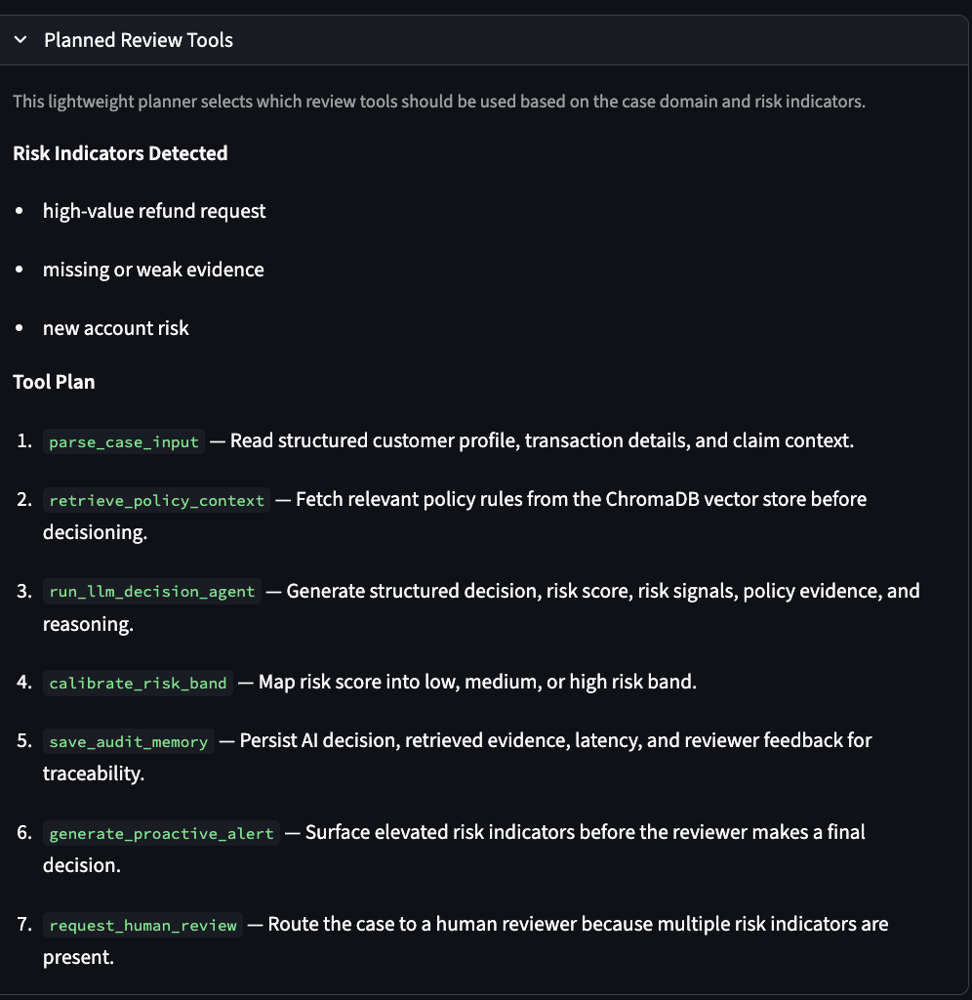
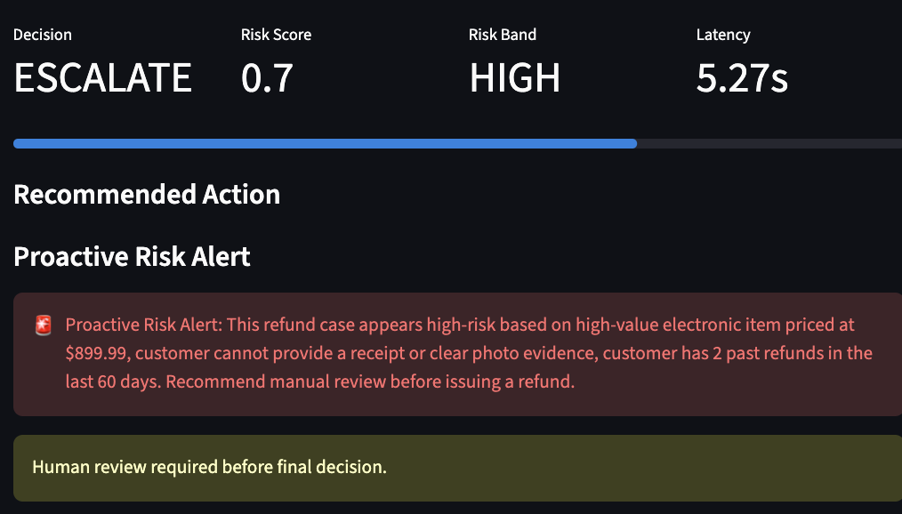
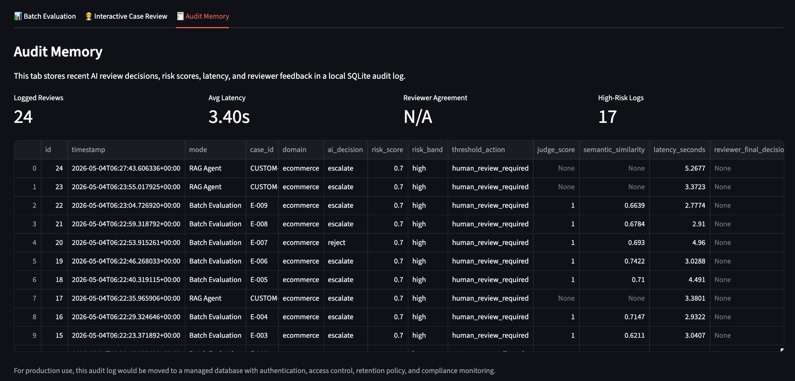

# TrustGuard AI: Policy-Grounded RiskOps Copilot

[](https://trustguard-ai-risk-copilot-ilrdnbebhn5pkx8tpny4yx.streamlit.app/)


> Policy-grounded RiskOps decision copilot for financial compliance and refund-risk review, combining RAG, structured LLM decisioning, tool-calling-style planning, proactive alerts, audit memory, and human feedback.

**Live Demo:** [Open TrustGuard AI Streamlit App](https://trustguard-ai-risk-copilot-ilrdnbebhn5pkx8tpny4yx.streamlit.app/)

Inspired by manual audit workflows from a PwC internship handling 200K+ fund disbursement records.

---

## System Architecture


The knowledge base combines the publicly available FINRA 2025 Annual Regulatory Oversight Report for financial compliance review with a curated e-commerce return policy file for refund-risk demonstration.

---

## Problem

Customer-facing companies often need to make fast and explainable decisions under uncertainty.

In e-commerce, teams review refund requests, return abuse, missing evidence, and high-value product disputes. In financial services, risk and compliance teams review suspicious transactions, new account risk, rapid fund movement, and geographic risk.

These workflows share the same challenge:

> Analysts must combine case details, customer behavior, policy rules, and risk signals to make consistent and explainable decisions.

Traditional rule-based systems are often too rigid, while plain LLM chatbots may hallucinate, ignore policy constraints, or fail to provide policy-grounded reasoning.

---

## Solution

TrustGuard AI is designed as a decision copilot rather than a simple chatbot.

For each case, the system:

1. Parses structured case input, including customer profile, transaction details, and risk signals.
2. Plans review steps using a lightweight tool-calling-style planner.
3. Retrieves relevant policy rules using a local ChromaDB vector store.
4. Sends the case and retrieved policy context to an LLM decision agent.
5. Generates a structured decision: approve, reject, or escalate.
6. Assigns a risk score and threshold-based operational action.
7. Generates proactive alerts for high-risk cases.
8. Saves AI outputs and reviewer feedback into SQLite audit memory.
9. Displays results in an interactive Streamlit dashboard.

---

## Demo Screenshots

### Batch Evaluation Dashboard

The batch evaluation view summarizes reference match rate, human review rate, judge score, decision distribution, risk-band distribution, latency, alert rate, and case-level evaluation results.


### Interactive Case Review

The interactive review page allows users to load a sample case, edit structured case JSON, choose between a faster RAG Agent and a deeper draft-critique-refine review mode, and run a policy-grounded risk decision.

<p align="center">
  
  
</p>

### Tool-Calling-Style Review Planner

Before generating a final recommendation, TrustGuard AI creates a lightweight review plan that selects relevant workflow steps, such as policy retrieval, structured LLM decisioning, risk calibration, proactive alerting, human review routing, and audit-memory logging.



### Retrieved Policy Evidence

For transparency, the system surfaces retrieved policy context used by the decision agent, helping reviewers understand which rules influenced the final recommendation.


### Proactive Alert & Reviewer Feedback

The interactive review workflow surfaces high-risk alerts and allows a human reviewer to accept, override, or annotate the AI recommendation.



### Audit Memory

Each AI-assisted review is saved into a lightweight SQLite audit log, including the AI decision, risk score, retrieved policy evidence, latency, and reviewer feedback.



---

## Multi-Step RiskOps Workflow

TrustGuard AI is designed as a multi-step AI review workflow rather than a single-step chatbot. The system coordinates policy retrieval, structured LLM decisioning, risk calibration, proactive alerting, audit logging, and reviewer feedback collection.

The review workflow includes:

1. **Parse structured case input**: read customer profile, transaction details, and risk signals.
2. **Plan review tools**: select review steps based on domain and detected risk indicators.
3. **Retrieve policy context**: use ChromaDB retrieval to fetch relevant FINRA or e-commerce policy rules.
4. **Generate structured decision**: return decision, risk score, risk signals, policy evidence, and reasoning.
5. **Calibrate operational action**: map risk score into auto-approve, secondary review, or human escalation.
6. **Generate proactive alert**: surface high-risk warnings for urgent reviewer attention.
7. **Save audit memory**: persist AI output, latency, retrieved evidence, and reviewer feedback into SQLite.

---

## Audit Memory & Human Feedback Loop

The system includes a lightweight SQLite-based audit memory that records each AI-assisted review, including:

- case ID and domain
- AI decision and risk score
- risk band and threshold action
- retrieved policy evidence
- LLM reasoning
- review latency
- reviewer final decision
- reviewer agreement or override

This simulates how a risk operations team could preserve traceability, review AI recommendations, and collect human feedback for future evaluation and prompt improvement.

---

## Operational Monitoring

The dashboard tracks operational signals such as:

- reference match rate
- human review rate
- average judge score
- risk-band distribution
- proactive alert rate
- review latency
- reviewer agreement rate

These metrics help evaluate not only decision quality, but also whether the AI workflow is practical for real review operations.

---

## Key Features

- RAG-based policy retrieval using ChromaDB
- FINRA-derived financial compliance policy ingestion
- Structured LLM decisioning with OpenAI API
- Tool-calling-style review planner based on case risk indicators
- Proactive risk alerts for high-risk cases
- Risk score calibration and threshold-based human-review routing
- LLM-as-Judge scoring for decision and reasoning quality
- Embedding-based semantic similarity evaluation
- SQLite audit memory for review history and traceability
- Reviewer feedback loop for human agreement, overrides, and notes
- Streamlit dashboard for batch evaluation, single-case review, and audit memory
- Optional draft-critique-refine review mode for deeper case analysis

---

## Evaluation Design

TrustGuard AI does not rely only on simple accuracy. The evaluation layer combines multiple signals:

| Evaluation Signal | Purpose |
|---|---|
| Reference Match Rate | Measures whether the AI decision matches the expected case label |
| LLM-as-Judge Score | Evaluates decision correctness and reasoning quality |
| Semantic Similarity | Measures alignment between AI reasoning and reference rationale |
| Risk Band Distribution | Shows how cases are routed across low, medium, and high risk |
| Human Review Rate | Estimates operational review workload |
| Alert Rate | Tracks how often proactive high-risk alerts are triggered |
| Latency | Measures practical runtime for AI-assisted review |

A high reference match rate should be interpreted as a workflow validation signal, not as proof of production-level model performance.

---

## Tech Stack

| Layer | Tools |
|---|---|
| Application | Streamlit |
| Language | Python |
| LLM | OpenAI API |
| Retrieval | ChromaDB |
| Knowledge Base | FINRA 2025 Annual Regulatory Oversight Report, curated e-commerce policy |
| Evaluation | LLM-as-Judge, semantic similarity, reference matching |
| Audit Memory | SQLite |
| Deployment | Streamlit Cloud |

---

## Project Structure

```text
trustguard-ai/
├── app/
│   └── main.py                         # Streamlit dashboard
├── data/
│   ├── cases/
│   │   └── cases.json                  # Curated benchmark cases
│   ├── policies/
│   │   ├── ecommerce_return_policy.txt # E-commerce refund-risk policy
│   │   └── financial_risk_policy.txt   # FINRA-derived financial risk policy
│   └── vector_db/                      # Local ChromaDB vector store (ignored)
├── docs/
│   ├── pipeline.png                    # System architecture diagram
│   └── screenshots/                    # Demo screenshots
├── notebooks/
│   ├── 01_problem_framing_and_data.ipynb
│   └── 02_modular_pipeline_demo.ipynb
├── src/
│   ├── audit_logger.py                 # SQLite audit memory + reviewer feedback
│   ├── config.py                       # Project paths and environment config
│   ├── data_generator.py               # Synthetic case generation utilities
│   ├── data_loader.py                  # Case and policy loading utilities
│   ├── evaluator.py                    # LLM-as-judge + semantic similarity
│   ├── ingest_finra.py                 # FINRA PDF ingestion
│   ├── llm_agent.py                    # RAG agent + draft-critique-refine mode
│   ├── policy_loader.py                # Policy file loader
│   ├── risk_planner.py                 # Tool-calling-style review planner
│   └── vector_store.py                 # ChromaDB retrieval
├── requirements.txt
└── README.md
```

---

## How to Run Locally

### 1. Clone the repository

```bash
git clone https://github.com/KaitlynLia/trustguard-ai-risk-copilot.git
cd trustguard-ai-risk-copilot
```

### 2. Create and activate environment

```bash
conda create -n trustguard-ai python=3.10
conda activate trustguard-ai
```

### 3. Install dependencies

```bash
pip install -r requirements.txt
```

### 4. Set OpenAI API key

Create a `.env` file in the project root:

```bash
OPENAI_API_KEY=your_openai_api_key
```

### 5. Optional: ingest FINRA policy source

```bash
python src/ingest_finra.py
```

### 6. Run Streamlit app

```bash
python -m streamlit run app/main.py
```

---

## Example Structured Output

```json
{
  "decision": "escalate",
  "risk_score": 0.8,
  "risk_signals": [
    "new account with high-value transaction",
    "rapid movement of funds",
    "transaction involving high-risk jurisdiction"
  ],
  "policy_evidence": [
    "New accounts with high-value transactions should receive additional scrutiny.",
    "Multiple large transfers within a short period may indicate elevated risk."
  ],
  "reasoning": "The case presents multiple high-risk indicators and should be routed to human review."
}
```

---

## Limitations & Future Work

This project is a portfolio-oriented prototype rather than a production risk engine. The financial compliance knowledge base is based on the publicly available FINRA 2025 Annual Regulatory Oversight Report, while the e-commerce policy and benchmark cases are curated for demonstration and do not contain real customer or transaction records.

Current limitations include:

- The benchmark cases are curated and not real customer or transaction records.
- Reference labels are rule-based and manually designed for demonstration.
- LLM-as-Judge scores are useful for qualitative evaluation, but should not replace expert human review.
- The SQLite audit log is a local prototype and does not include production access control, retention policies, or compliance monitoring.
- The system does not yet include authentication, role-based permissions, or production-grade monitoring.
- The tool-calling-style planner is a lightweight deterministic planner, not a fully autonomous agent.

Future improvements:

- Evaluate on larger independently labeled historical review cases.
- Add stricter adversarial and edge-case testing.
- Improve risk calibration using historical outcomes.
- Add production audit logging with managed database storage.
- Track token usage, cost, latency, and model consistency across repeated runs.
- Add role-based review workflows for analysts and managers.
- Add explicit tool-calling APIs or a FastAPI backend for service-oriented deployment.

---

## Resume Summary

TrustGuard AI demonstrates how policy-grounded LLM systems can support explainable risk review workflows by combining retrieval, structured decisioning, evaluation, proactive alerting, audit memory, and human feedback.

Suggested resume bullet:

> Built a policy-grounded RiskOps decision copilot using FINRA 2025 regulatory content, ChromaDB retrieval, OpenAI-based structured decisioning, LLM-as-Judge evaluation, proactive risk alerts, SQLite audit memory, and Streamlit deployment for financial compliance and refund-risk review.

---

## License

MIT License.