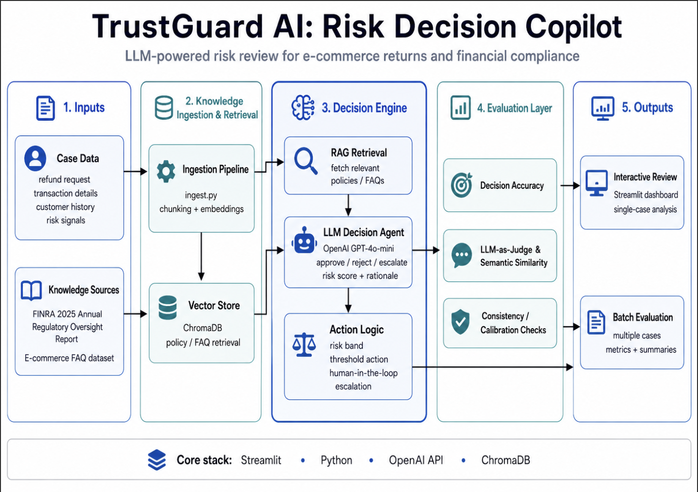
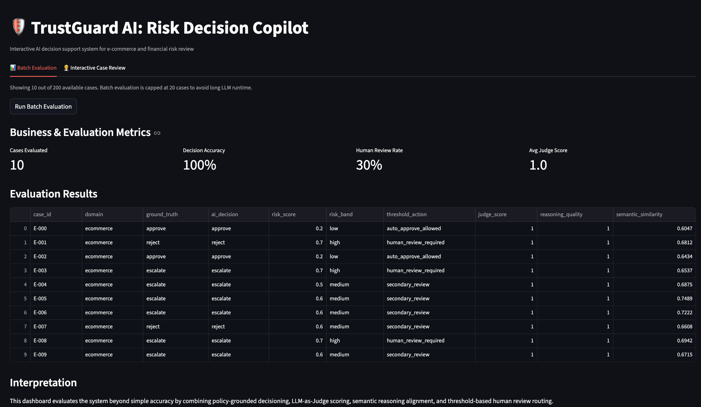
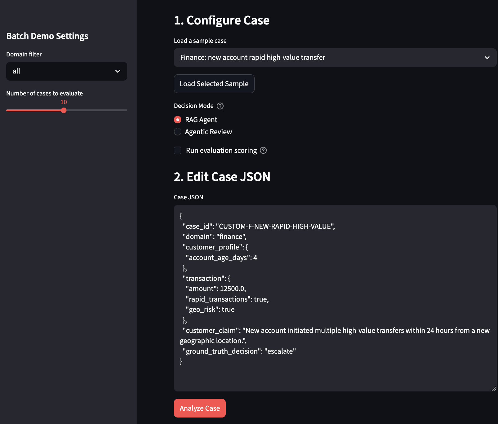
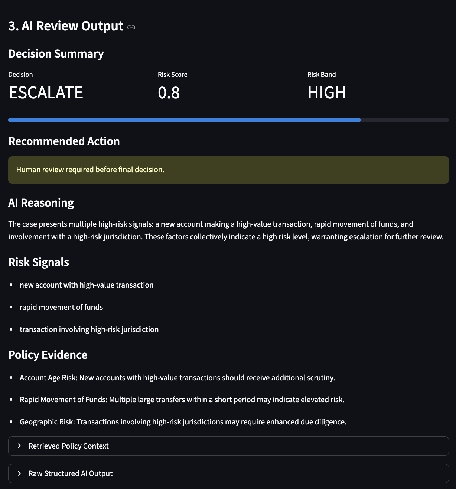
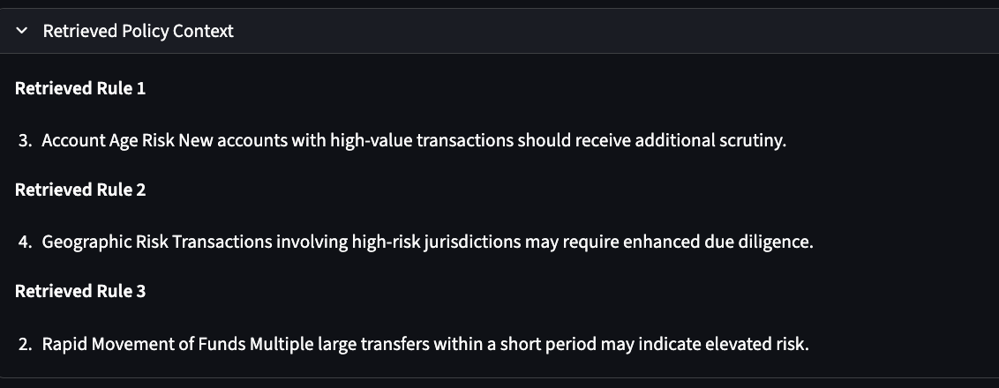

# TrustGuard AI: Risk Decision Copilot

TrustGuard AI is a prototype AI decision support system for e-commerce refund review and financial transaction risk review.

The project simulates policy-driven risk workflows and uses LLM-based decisioning, RAG-based policy retrieval, multi-layer evaluation, and a Streamlit dashboard to support human-in-the-loop risk review.

**Live Demo:** [Open TrustGuard AI Streamlit App](https://trustguard-ai-risk-copilot-ilrdnbebhn5pkx8tpny4yx.streamlit.app/)

# TrustGuard AI: Risk Decision Copilot

[](https://trustguard-ai-risk-copilot-ilrdnbebhn5pkx8tpny4yx.streamlit.app/)


)

> > Agentic AI risk decision copilot for financial compliance and refund-risk review, combining RAG, structured LLM decisioning, audit memory, proactive risk alerts, and human-in-the-loop feedback.
> Inspired by manual audit workflows from a PwC internship handling 200K+ fund disbursement records.

## System Architecture



Knowledge base sourced from FINRA 2025 Annual Regulatory Oversight Report (public domain) and e-commerce FAQ dataset (HuggingFace: Andyrasika/Ecommerce_FAQ)
## Problem

Customer-facing companies often need to make fast and explainable decisions under uncertainty.

In e-commerce, teams review refund requests, return abuse, missing evidence, and high-value product disputes.  
In financial services, risk and compliance teams review suspicious transactions, new account risk, rapid fund movement, and geographic risk.

These workflows share the same challenge:

> Analysts must combine case details, customer behavior, policy rules, and risk signals to make consistent and explainable decisions.

Traditional rule-based systems are often too rigid, while plain LLM chatbots may hallucinate or fail to provide policy-grounded reasoning.

## Solution

TrustGuard AI is designed as a decision copilot rather than a simple chatbot.

For each case, the system:

1. Retrieves relevant policy rules using a local vector store
2. Sends the case and retrieved policy context to an LLM decision agent
3. Generates a structured decision: approve, reject, or escalate
4. Assigns a risk score and recommended operational action
5. Evaluates the result using multiple evaluation layers
6. Displays results in an interactive Streamlit dashboard

## Demo Screenshots

### Batch Evaluation Dashboard

The batch evaluation view summarizes reference match rate, human review rate, judge score, decision distribution, risk-band distribution, and case-level evaluation results.



### Interactive Case Review

The interactive review page allows users to load a sample case, edit structured case JSON, choose between a faster RAG Agent and a deeper Agentic Review mode, and run a policy-grounded risk decision.

<p align="center">
  
  
</p>

### Retrieved Policy Evidence

For transparency, the system surfaces retrieved policy context used by the decision agent, helping reviewers understand which rules influenced the final recommendation.



## Agentic RiskOps Workflow

TrustGuard AI is designed as an agentic risk operations workflow rather than a single-step chatbot. The system coordinates multiple steps to support explainable, policy-grounded decision review:

1. **Parse structured case input**: read customer profile, transaction details, and risk signals.
2. **Retrieve policy context**: use ChromaDB retrieval to fetch relevant FINRA or e-commerce policy rules.
3. **Generate structured decision**: ask the LLM agent to return decision, risk score, risk signals, policy evidence, and reasoning.
4. **Calibrate operational action**: map risk score into auto-approve, secondary review, or human escalation.
5. **Generate proactive alert**: surface high-risk warnings for cases requiring urgent reviewer attention.
6. **Save audit memory**: persist AI output, latency, retrieved evidence, and reviewer feedback into SQLite.

## Audit Memory & Human Feedback Loop

The system includes a lightweight SQLite-based audit memory that records each AI-assisted review, including:

- case ID and domain
- AI decision and risk score
- risk band and threshold action
- retrieved policy evidence
- LLM reasoning
- latency
- reviewer final decision
- reviewer agreement or override

This simulates how a real risk operations team could preserve traceability, review AI recommendations, and collect human feedback for future evaluation and prompt improvement.

## Operational Monitoring

The dashboard tracks operational signals such as:

- reference match rate
- human review rate
- average judge score
- risk-band distribution
- proactive alert rate
- review latency

These metrics help evaluate not only decision quality, but also whether the AI workflow is practical for real review operations.

## Key Features

- RAG-based policy retrieval using ChromaDB
- Structured LLM decisioning with OpenAI API
- E-commerce and finance risk review scenarios
- LLM-as-Judge evaluation for correctness and reasoning quality
- Embedding-based semantic similarity evaluation
- Consistency testing across repeated LLM runs
- Risk score calibration and threshold-based routing
- Streamlit dashboard for batch evaluation and interactive case review
- Optional draft–critique–refine agentic workflow

## System Pipeline

```text
Case Input
    ↓
Policy Retrieval (RAG)
    ↓
LLM Decision Agent
    ↓
Structured Output
    - decision
    - risk score
    - risk signals
    - policy evidence
    - recommended action
    ↓
Evaluation Layer
    - LLM-as-Judge
    - Semantic Similarity
    - Consistency Test
    ↓
Human-in-the-loop Review Routing

Project Structure
trustguard-ai/
├── app/
│   └── main.py
├── data/
│   ├── cases/
│   │   └── cases.json
│   ├── policies/
│   │   ├── ecommerce_return_policy.txt
│   │   └── financial_risk_policy.txt
│   └── vector_db/
├── notebooks/
│   ├── 01_problem_framing_and_data.ipynb
│   └── 02_modular_pipeline_demo.ipynb
├── src/
│   ├── config.py
│   ├── data_generator.py
│   ├── evaluator.py
│   ├── llm_agent.py
│   ├── policy_loader.py
│   └── vector_store.py
├── requirements.txt
└── README.md
Dashboard

The Streamlit dashboard has two main modes:

Batch Evaluation

Runs multiple cases through the AI pipeline and displays:

Decision accuracy
Human review rate
Average judge score
Risk score
Threshold action
Semantic similarity
Interactive Case Review

Allows users to manually enter a new case and receive:

AI decision
Risk score
Risk band
Recommended operational action
Reasoning
Risk signals
Retrieved policy rules
Evaluation scores
Evaluation Design

This project evaluates AI decision quality beyond simple accuracy.

1. LLM-as-Judge

Scores model outputs on:

Decision correctness
Policy grounding
Reasoning quality
Risk score alignment
2. Embedding-based Semantic Similarity

Measures whether the model's reasoning is semantically aligned with reference policy-based reasoning.

3. Consistency Testing

Runs the same case multiple times to check whether decisions and risk scores remain stable under stochastic LLM settings.

4. Risk Calibration

Maps raw model risk scores into operational actions:

Low risk → auto-approve allowed
Medium risk → secondary review
High risk → human review required
Key Insights
The system performs well on structured policy-driven cases.
Correct decisions do not always guarantee strong reasoning alignment.
Semantic similarity helps identify shallow or incomplete reasoning.
Risk scores tend to cluster around thresholds, showing the need for better calibration.
Agentic review improves explainability but increases API cost and latency.
Human-in-the-loop routing is more appropriate than fully automated approval or rejection.
How to Run
1. Create environment
conda create -n trustguard-ai python=3.10 -y
conda activate trustguard-ai
2. Install dependencies
python -m pip install -r requirements.txt
3. Add OpenAI API key

Create a .env file in the project root:

OPENAI_API_KEY=your_api_key_here

Do not upload .env to GitHub.

4. Run the Streamlit app
python -m streamlit run app/main.py
Limitations

This is a prototype project, not a production fraud detection system.

Current limitations include:

Synthetic policy-driven cases rather than real confidential risk data
Small policy documents
Simple risk score calibration
Limited benchmark size
API cost and latency for agentic review mode
Future Improvements
Add real-world anonymized case data
Improve policy ingestion for longer documents
Add learned risk calibration
Add monitoring for drift and hallucination
Deploy the dashboard on Streamlit Cloud or Hugging Face Spaces
Add role-based review workflows for analysts and managers
Resume Summary

Built a prototype AI risk decision copilot for e-commerce and financial transaction review using OpenAI API, RAG-based policy retrieval, structured LLM decisioning, multi-layer evaluation, and an interactive Streamlit dashboard.